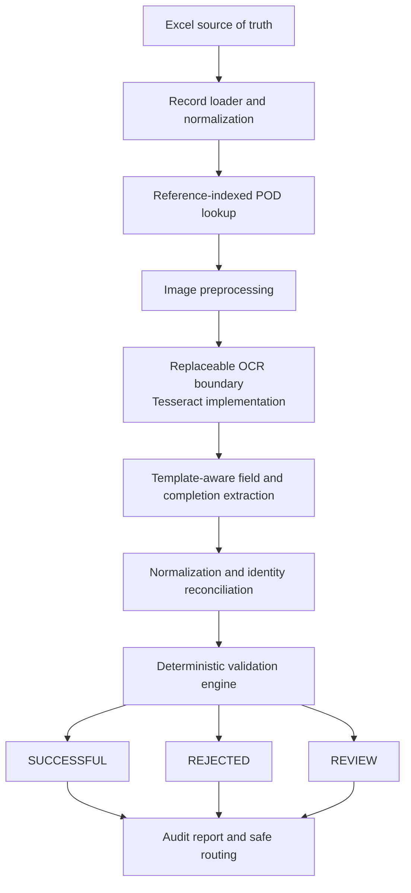

# Architecture

The spreadsheet and POD directory are each scanned once. OCR is isolated in `docrecon/ocr.py`; validation accepts structured models and can be tested without Tesseract. The current extractor combines document-wide OCR with a known completion-section layout. This is template-aware V1, not general document understanding. Errors are contained per document.
